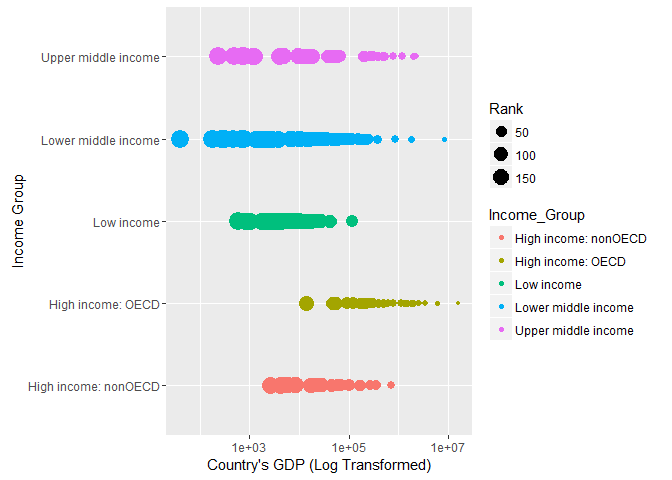

# CaseStudy1_GDP
Vivek Bejugama  
October 27, 2016  

##Intoduction:
The following is the end-to-end(downloading data to reporting) analysis of countires GDP vs their respective income groups classifications. 


```r
#Initializing the project variables:
rootDir <- "C://Users//vivek//Documents//R//R_Projects//CaseStudy1_GDP"
fileDir <- ".//Data_Files"
scriptDir <- ".//Scripts"
setwd(rootDir)
```

##DownLoading and Preparing tidy-data for analysis
Gathering the raw data from The World Bank website.
GDP - http://data.worldbank.org/data-catalog/GDP-ranking-table
Education - http://data.worldbank.org/data-catalog/ed-stats

```r
#Moving to the scirpts directory
setwd(rootDir)
setwd(scriptDir)

# calling the Data downloding script
source("Data_Gather.R", echo =T, keep.source = T,  max.deparse.length = 500)   
```

```
## 
## > ###############################
## > # Script for Downloading Raw Data Files
## > # Vivek Bejugama
## > # October 20, 2016
## > ###############################
## > 
## > #Libraries
## > library(downloader)
## 
## > #Initializing the Project Directories
## > rootDir <- "C://Users//vivek//Documents//R//R_Projects//CaseStudy1_GDP"
## 
## > fileDir <- ".//Data_Files"
## 
## > scriptDir <- ".//Scripts"
## 
## > setwd(rootDir)
## 
## > # File URLs
## > gdp_URL <- "https://d396qusza40orc.cloudfront.net/getdata%2Fdata%2FGDP.csv"
## 
## > edu_URL <- "https://d396qusza40orc.cloudfront.net/getdata%2Fdata%2FEDSTATS_Country.csv"
## 
## > # Download Files
## > setwd(fileDir)
## 
## > download.file(gdp_URL, destfile = ".//GDP_DATA.csv")
## 
## > download.file(edu_URL, destfile = ".//EDU_DATA.csv")
```

Creating a final clean merged dataset 

```r
#Moving to the scirpts directory
setwd(rootDir)
setwd(scriptDir) 

# Calling the Data Preparation script
source("Data_Prep.R", echo =T, keep.source = T, max.deparse.length = 500)
```

```
## 
## > ###############################
## > # Preparing Tidy Data and Merging to create a final clean dataset. 
## > # Vivek Bejugama
## > # October 20, 2016
## > ###############################
## > 
## > #Libraries
## > library(plyr)
## 
## > #Initialize working Directories
## > setwd(rootDir)
## 
## > setwd(fileDir)
## 
## > #Tidy GDP Data
## > rawGDP <- read.csv("GDP_DATA.csv", header = F, skip = 5, stringsAsFactors = F)  #Importing data and Excluding Header
## 
## > rawGDP <- rawGDP[1:190,]                    #Excluding tail recrods. 
## 
## > cln_GDP <- rawGDP[,c("V1","V2","V4","V5")]  #Selecting the Column needed
## 
## > names(cln_GDP) <- c("Country_Code", "Rank" ,"Country", "GDP_2012") #Assigning the names of column.
## 
## > cln_GDP$Rank <- as.integer(cln_GDP$Rank)    #Converting the rank to integer
## 
## > cln_GDP$GDP_2012 <- as.numeric(gsub("[^[:digit:]]","", cln_GDP$GDP_2012)) #removing comas and converting to numeric
## 
## > #Sample GDP dataset
## > head(cln_GDP)
##   Country_Code Rank        Country GDP_2012
## 1          USA    1  United States 16244600
## 2          CHN    2          China  8227103
## 3          JPN    3          Japan  5959718
## 4          DEU    4        Germany  3428131
## 5          FRA    5         France  2612878
## 6          GBR    6 United Kingdom  2471784
## 
## > tail(cln_GDP)
##     Country_Code Rank               Country GDP_2012
## 185          FSM  185 Micronesia, Fed. Sts.      326
## 186          STP  186 São Tomé and Principe      263
## 187          PLW  187                 Palau      228
## 188          MHL  188      Marshall Islands      182
## 189          KIR  189              Kiribati      175
## 190          TUV  190                Tuvalu       40
## 
## > #Tidy Education Data
## > rawEDU <- read.csv("EDU_DATA.csv", header = T , stringsAsFactors = F)  
## 
## > cln_EDU <- rawEDU[,c("CountryCode","Short.Name","Income.Group")]
## 
## > names(cln_EDU) <- c("Country_Code","Country", "Income_Group")
## 
## > cln_EDU <- cln_EDU[-1*(which(cln_EDU$Income_Group == "")),]   # removing invalid data
## 
## > #Sample Education dataset
## > head(cln_EDU)
##   Country_Code              Country         Income_Group
## 1          ABW                Aruba High income: nonOECD
## 2          ADO              Andorra High income: nonOECD
## 3          AFG          Afghanistan           Low income
## 4          AGO               Angola  Lower middle income
## 5          ALB              Albania  Upper middle income
## 6          ARE United Arab Emirates High income: nonOECD
## 
## > tail(cln_EDU)
##     Country_Code         Country        Income_Group
## 229          WSM           Samoa Lower middle income
## 230          YEM           Yemen Lower middle income
## 231          ZAF    South Africa Upper middle income
## 232          ZAR Dem. Rep. Congo          Low income
## 233          ZMB          Zambia          Low income
## 234          ZWE        Zimbabwe          Low income
## 
## > #Creating Single Final cleann DataFrame by left join with GDP to Education dataset
## > gdp_edu <- merge(x = cln_GDP, y = cln_EDU, by = "Country_Code", all.x = T ) 
## 
## > #Sample Education dataset
## > str(gdp_edu)
## 'data.frame':	190 obs. of  6 variables:
##  $ Country_Code: chr  "ABW" "AFG" "AGO" "ALB" ...
##  $ Rank        : int  161 105 60 125 32 26 133 172 12 27 ...
##  $ Country.x   : chr  "Aruba" "Afghanistan" "Angola" "Albania" ...
##  $ GDP_2012    : num  2584 20497 114147 12648 348595 ...
##  $ Country.y   : chr  "Aruba" "Afghanistan" "Angola" "Albania" ...
##  $ Income_Group: chr  "High income: nonOECD" "Low income" "Lower middle income" "Upper middle income" ...
## 
## > head(gdp_edu)
##   Country_Code Rank            Country.x GDP_2012            Country.y
## 1          ABW  161                Aruba     2584                Aruba
## 2          AFG  105          Afghanistan    20497          Afghanistan
## 3          AGO   60               Angola   114147               Angola
## 4          ALB  125              Albania    12648              Albania
## 5          ARE   32 United Arab Emirates   348595 United Arab Emirates
## 6          ARG   26            Argentina   475502            Argentina
##           Income_Group
## 1 High income: nonOECD
## 2           Low income
## 3  Lower middle income
## 4  Upper middle income
## 5 High income: nonOECD
## 6  Upper middle income
## 
## > tail(gdp_edu)
##     Country_Code Rank        Country.x GDP_2012       Country.y
## 185          WSM  181            Samoa      684           Samoa
## 186          YEM   90      Yemen, Rep.    35646           Yemen
## 187          ZAF   28     South Africa   384313    South Africa
## 188          ZAR  112 Congo, Dem. Rep.    17204 Dem. Rep. Congo
## 189          ZMB  104           Zambia    20678          Zambia
## 190          ZWE  134         Zimbabwe     9802        Zimbabwe
##            Income_Group
## 185 Lower middle income
## 186 Lower middle income
## 187 Upper middle income
## 188          Low income
## 189          Low income
## 190          Low income
```

##Analysis of the merged clean Data frames
a. No. of missing matches  
b. Sorting the merged Data Frame ascending order of GDP.
c. 13th Country in the sorted data
d. Average GDP rankings for the "high income: OECD" and "High income: non OECD" gorups

```r
#Moving to the scirpts directory
setwd(rootDir)
setwd(scriptDir) 

# Calling the Data Analysis script
source("Data_Analysis.R", echo =T, keep.source = T,  max.deparse.length = 500)
```

```
## 
## > #########
## > # Scirpt to Analyse the data
## > # Vivek Bejugama
## > # October 20, 2016
## > #########
## > 
## > #No. of ID's matching
## > count(is.na(gdp_edu$Country.y))   # 1 Country from GDP data is missing in Education Dataset
##       x freq
## 1 FALSE  189
## 2  TRUE    1
## 
## > #Sorting the Clean Data based on GDP in ascending order
## > sorted_gdp_edu <- gdp_edu[order(gdp_edu$GDP_2012),]
## 
## > # Sample of sorted data
## > head(sorted_gdp_edu)
##     Country_Code Rank             Country.x GDP_2012             Country.y
## 174          TUV  190                Tuvalu       40                Tuvalu
## 92           KIR  189              Kiribati      175              Kiribati
## 113          MHL  188      Marshall Islands      182      Marshall Islands
## 137          PLW  187                 Palau      228                 Palau
## 156          STP  186 São Tomé and Principe      263 São Tomé and Principe
## 59           FSM  185 Micronesia, Fed. Sts.      326            Micronesia
##            Income_Group
## 174 Lower middle income
## 92  Lower middle income
## 113 Lower middle income
## 137 Upper middle income
## 156 Lower middle income
## 59  Lower middle income
## 
## > #13th Country in the sorted data frame
## > sorted_gdp_edu[13,c("Country_Code","Country.x","GDP_2012")]
##    Country_Code           Country.x GDP_2012
## 93          KNA St. Kitts and Nevis      767
## 
## > #Average GDP Ranking of High income: OECD members
## > mean(gdp_edu[which(gdp_edu$Income_Group == "High income: OECD" & is.na(gdp_edu$Rank) == F ),c("Rank")])
## [1] 32.96667
## 
## > #Average GDP Ranking of High income: nonOECD members
## > mean(gdp_edu[which(gdp_edu$Income_Group == "High income: nonOECD" & is.na(gdp_edu$Rank) == F ),c("Rank")])
## [1] 91.91304
```

##Ploting the GDP vs income group
a. Plot of all countires by income groups seperated by differnt colours

```r
#Moving to the scirpts directory
setwd(rootDir)
setwd(scriptDir) 

# Calling the Data Plot script
source("Data_Present.R", echo =T, keep.source = T, max.deparse.length = 500)
```

```
## 
## > #########
## > # Scirpt to Presenting the data
## > # Vivek Bejugama
## > # October 20, 2016
## > #########
## > 
## > #Libraries
## > library(ggplot2)
## 
## > #A Plot with coutries GDP for each Income Group, sized according to their Rank.
## > ggplot(gdp_edu, aes(x=gdp_edu$GDP_2012, y=gdp_edu$Income_Group)) + 
## +   geom_point(aes(colour=Income_Group, size = Rank)) +
## +   scale_x_log10(name="Country's GDP (Log Transformed)") +    #since the GDP as right skewed they are log transformed.
## +   scale_y_discrete(name="Income Group")
```

```
## Warning: Removed 1 rows containing missing values (geom_point).
```

<!-- -->

##Dividing the data into 5 Quartile Gorups.
a. GDP ranking divided into 5 quartile groups

```r
#Moving to the scirpts directory
setwd(rootDir)
setwd(scriptDir) 

# Calling the Data Analysis script
source("Data_Quantile.R", echo =T, keep.source = T, max.deparse.length = 500)
```

```
## 
## > #########
## > # Scirpt to Divide Data into 5 Qantiles
## > # Vivek Bejugama
## > # October 20, 2016
## > #########
## > 
## > library(ggplot2)
## 
## > # Adding a new Column to the dataframe with its corresponding Quantile group divided into 5(20%,40%,60%,80%) groups
## > sorted_gdp_edu$quartile <- with(sorted_gdp_edu, factor(
## +   findInterval( sorted_gdp_edu$GDP_2012, c(-Inf,
## +                        quantile(sorted_gdp_edu$GDP_2012, probs=c(0.2, 0.4, .6, .8)), Inf)), 
## +   labels=c("Q1","Q2","Q3","Q4","Q5")
## + ))
## 
## > group20 <- subset(sorted_gdp_edu,quartile == "Q1")   #lowest Quartile
## 
## > group40 <- subset(sorted_gdp_edu,quartile == "Q2")
## 
## > group60 <- subset(sorted_gdp_edu,quartile == "Q3")
## 
## > group80 <- subset(sorted_gdp_edu,quartile == "Q4")
## 
## > group100 <- subset(sorted_gdp_edu,quartile == "Q5") # Highest Quartile
## 
## > #Countries in Lower middle income group in Upper quartile
## > subset(group100,Income_Group == "Lower middle income")
##     Country_Code Rank        Country.x GDP_2012 Country.y
## 51           EGY   38 Egypt, Arab Rep.   262832     Egypt
## 166          THA   31         Thailand   365966  Thailand
## 77           IDN   16        Indonesia   878043 Indonesia
## 78           IND   10            India  1841710     India
## 34           CHN    2            China  8227103     China
##            Income_Group quartile
## 51  Lower middle income       Q5
## 166 Lower middle income       Q5
## 77  Lower middle income       Q5
## 78  Lower middle income       Q5
## 34  Lower middle income       Q5
```

##Conclusion
From the above analysis we see we have about 5 countries thought they fall under lower middle income by income group they are still in top 20 percentile. 
The GDP is highly right skeewed for each income group suggesting there are few countries in each income group having way more GDP than rest in the group. 
High income:OECD member group have slightly greater mean and lower varience than the rest of the group.
Since this is an observational study we can not define cause and effect for the income level group and the GDP of the country.


